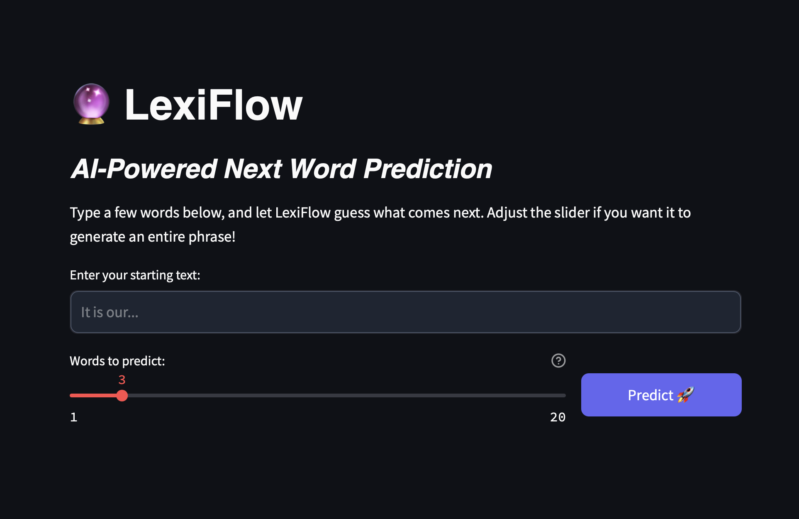
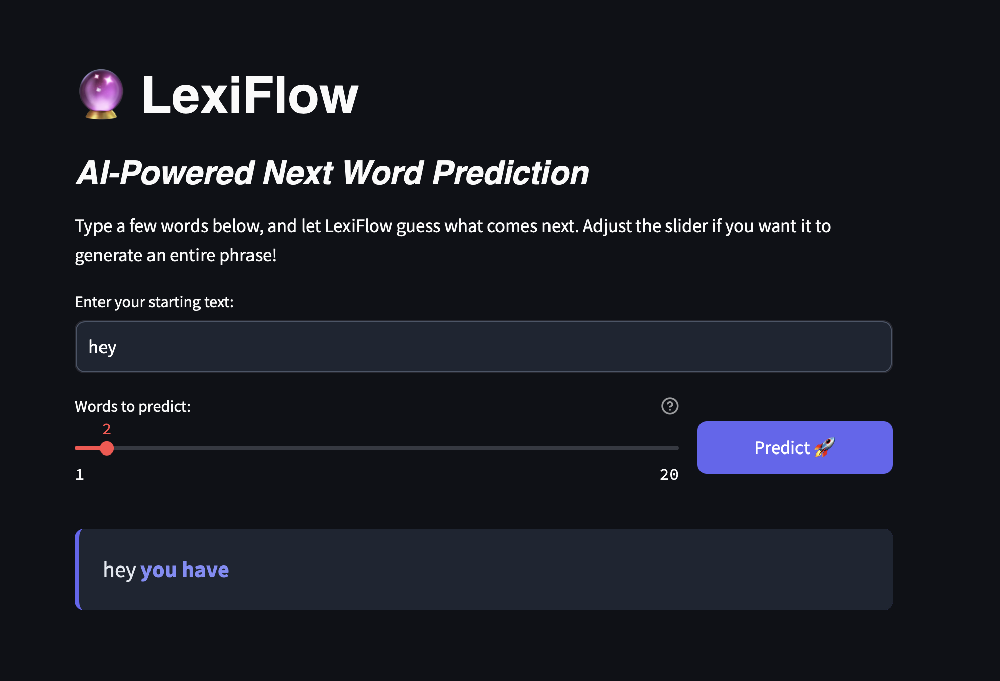

# 🔮 LexiFlow - Next Word Predictor

LexiFlow is an AI-powered Next Word Prediction application. It uses a deep learning LSTM (Long Short-Term Memory) model to analyze a given seed phrase and intelligently predict the following words. The project features a beautifully designed, modern user interface built with Streamlit.

## Features

- **Accurate Predictions**: Powered by an LSTM neural network trained on a dataset of quotes.
- **Customizable Generation**: Use a slider to predict exactly how many words you want (up to 20 words at a time).
- **Beautiful Interface**: A custom-styled, dark-themed UI that provides an excellent user experience.
- **Fast Inference**: Uses cached model loading via Streamlit to ensure predictions happen in real-time.

## Screenshots





## Technology Stack

- **Machine Learning**: TensorFlow & Keras (LSTM architecture)
- **Frontend / UI**: Streamlit
- **Data Processing**: Numpy, Pandas, Pickle

## Project Structure

- `app.py`: The main Streamlit web application script.
- `word_predictor.ipynb` / `word_predictor.py`: The training pipeline containing data preprocessing, tokenization, and the LSTM model architecture.
- `lstm_model.h5`: The trained Keras LSTM model.
- `tokenizer.pkl`: The saved word tokenizer.
- `max_len.pkl`: The maximum sequence length used for padding inputs.
- `quote_dataset.csv`: The dataset of quotes used to train the model.

## How to Run Locally

1. **Clone the repository** and navigate to the project directory:
   ```bash
   cd "Next Word Predictor"
   ```

2. **Install the required dependencies** (if you haven't already):
   ```bash
   pip install streamlit tensorflow numpy pandas
   ```

3. **Run the Streamlit application**:
   ```bash
   streamlit run app.py
   ```

4. **Open your browser** and navigate to `http://localhost:8501`.

## Usage

1. Enter a starting phrase into the text box (e.g., "It is our...").
2. Adjust the slider to determine how many words the AI should generate next.
3. Click the **Predict 🚀** button to see the AI's prediction highlighted on screen.
